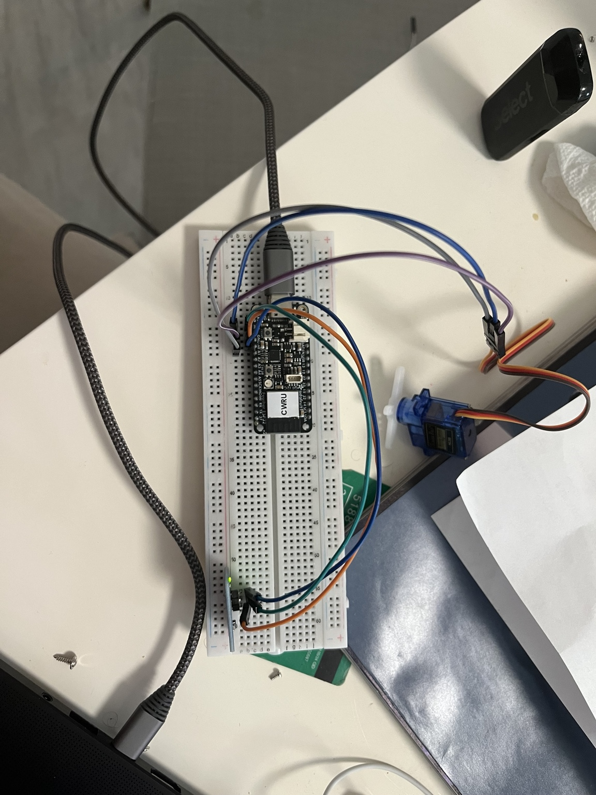

# Lab 5 - ESP32 Sensor and Actuator Integration

## Name
Aedan Reagans

## Assignment Overview

This is my last assignment working with the ESP32. In this lab, I integrated a sensor and an actuator to create a functioning smart system.

I used a touch sensor as the input and an SG90 servo motor as the actuator. When the touch sensor detects a touch, the ESP32 commands the servo to rotate to 90 degrees. When the touch sensor is released, the servo returns to 0 degrees.

I programmed the Adafruit Feather ESP32 V2 using Visual Studio Code and PlatformIO on Windows.

The code for the sensor and actuator integration can be found in:

`src/main.cpp`

The PlatformIO configuration can be found in:

`platformio.ini`

---

## Setup and Preparation

### Microcontroller
Adafruit Feather ESP32 V2

### Sensor
Touch Sensor Module

The touch sensor provides a digital input to the ESP32.

### Actuator
SG90 Servo Motor

The servo motor changes its angular position based on the touch sensor input.

---

## Wiring

### Touch Sensor Connections

| Touch Sensor | ESP32 |
|---|---|
| IO | A0 / GPIO 26 |
| VCC | 3V |
| GND | GND |

The touch sensor uses GPIO 26 as its digital input pin.

### SG90 Servo Connections

| Servo Wire | ESP32 |
|---|---|
| Brown - Ground | GND |
| Red - Power | USB / 5V |
| Orange - Signal | A1 / GPIO 25 |

The servo signal is controlled through GPIO 25.

---

## How the System Works

The ESP32 continuously reads the digital output from the touch sensor.

When the touch sensor is not being touched, the servo remains at 0 degrees.

When the touch sensor detects a touch, the ESP32 commands the SG90 servo to rotate to 90 degrees.

When the touch sensor is released, the servo returns to 0 degrees.

The basic system operation is:

`Touch Sensor -> ESP32 -> SG90 Servo Motor`

---

## Code Operation

The touch sensor is configured as a digital input on GPIO 26.

The SG90 servo is controlled using the ESP32Servo library and is connected to GPIO 25.

The program reads the touch sensor using:

```cpp
digitalRead(touchPin);
```

When a touch is detected, the servo moves to 90 degrees:

```cpp
myServo.write(90);
```

When no touch is detected, the servo returns to 0 degrees:

```cpp
myServo.write(0);
```

The Serial Monitor also displays the current state of the touch sensor.

---

## Tools Used

- Visual Studio Code
- PlatformIO
- Arduino Framework
- ESP32Servo Library
- Adafruit Feather ESP32 V2
- Touch Sensor Module
- SG90 Servo Motor
- Breadboard
- Jumper Wires
- USB Cable

---

## Upload Process

The program was written in Visual Studio Code using PlatformIO.

I first built the program using the PlatformIO Build command to verify that the code compiled successfully.

After receiving a successful build, I connected the Adafruit Feather ESP32 V2 to my computer using USB and uploaded the program using PlatformIO.

I then tested the system by touching and releasing the touch sensor while observing the servo response. The system worked correctly. When the touch sensor was touched, the servo rotated to approximately 90 degrees. When the touch sensor was released, the servo returned to approximately 0 degrees.

---

## Circuit Picture

The completed sensor and actuator circuit is shown below.



The touch sensor is connected to GPIO 26 and provides the input to the ESP32. The SG90 servo is connected to GPIO 25 and acts as the output of the system.

---

## Video Demonstration

A video demonstrating the working touch sensor and SG90 servo integration will be submitted as a comment on the Lab 5 Canvas assignment.

---


# Time Reporting and Reflection

## 1. How long did it take you to complete this assignment?

Approximately 2 hours.

## 2. What level of difficulty would you associate with this assignment?

- [x] Low
- [ ] Medium
- [ ] High

## 3. If you associated medium/high difficulty with this assignment, what aspect did you find the most difficult?

Although I rated the assignment as low difficulty, the most difficult part was the wiring and making sure each component was connected to the correct ESP32 pin.

## 4. How comfortable do you currently feel with the course content?

I feel comfortable with the course content and with using the ESP32 to connect and control sensors and actuators.

## 5. Do you have any additional information or feedback you would like to share with the instructors?

No additional feedback.